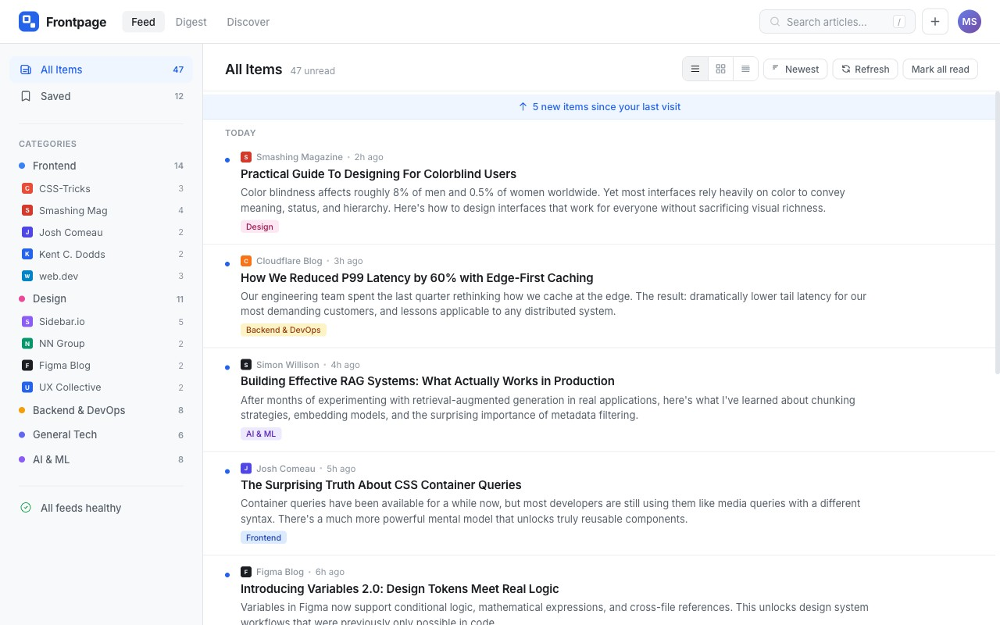

# Frontpage — Product Challenge

Build a customizable content aggregator that pulls RSS and Atom feeds into a single, well-designed reading dashboard. Your personalized front page for tech content.



*This is a design concept image, not the intended design. There's no Figma file — you make the design decisions.*

## The Challenge

Frontpage is a **Product Challenge** on [Frontend Mentor](https://www.frontendmentor.io). There's no Figma file — you make the design decisions. You ship a real, deployed product with a database, authentication, and external integrations. The result is a portfolio piece that demonstrates how you think, not just what you can build.

### Four Pillars

| Pillar | What It Means for Frontpage |
|--------|----------------------------|
| **Product Thinking** | You design the onboarding flow, digest view, and layout system. No spec tells you exactly how — you decide. |
| **Design Taste & Craft** | The brand kit gives you colors, type, and spacing. The layouts, interactions, and visual polish are yours. |
| **AI Collaboration** | The project includes AI context files (`AGENTS.md`, `CLAUDE.md`) that give tools like Claude full project context. Lean into AI across planning, building, and polishing. |
| **Shipping Real Products** | Deploy to a live URL. Real database. Real auth. Real RSS feeds with real-world parsing challenges. |

## What You're Building

A content aggregator where users:

- **Add RSS/Atom feeds** from blogs, newsletters, and publications they follow
- **Browse content** in a clean, scannable dashboard organized by category
- **Track reading** with read/unread state and bookmarks
- **Search** across all their feeds
- **Import/export** feed subscriptions via OPML
- **Customize** their reading experience with layout options

### The Guest Experience

When you share this project — in your portfolio, a job application, or a social post — the person clicking your link isn't going to create an account. Guest mode is what lets them see your work instead of a login wall.

Your landing page includes a "Try as Guest" button. Guests get a fully populated dashboard with 19 curated feeds across Frontend, Design, Backend & DevOps, General Tech, and AI & ML categories — real content from real sources. They're _using the product_ from their first click.

## Project Structure

```
frontpage/
├── spec/
│   ├── product-definition.md      # What, who, why
│   ├── core-requirements.md       # 18 features: 12 core + 6 stretch
│   ├── design-challenges.md       # 3 features YOU design
│   ├── technical-requirements.md  # Database, auth, deployment, performance
│   └── differentiators.md         # 5 enhancements — pick 1-2
├── guidance/
│   ├── brand-kit.md               # Colors, typography, spacing, icons, mood
│   ├── patterns.md                # UI/UX do's and don'ts
│   └── accessibility.md           # WCAG checklist
├── starter/
│   ├── tokens.css                 # CSS custom properties
│   └── tailwind.css               # Optional Tailwind v4 config
├── data/
│   ├── sample-feeds.opml          # OPML import file (with edge cases)
│   ├── sample-feeds.json          # Same feeds as JSON
│   └── README.md                  # Data edge case documentation
├── AGENTS.md                      # AI collaboration context
├── CLAUDE.md                      # Points to AGENTS.md
└── README-template.md             # Template for your solution README
```

## Getting Started

1. **Read the spec** — Start with `spec/product-definition.md`, then `core-requirements.md`. Understand what you're building before you write code.

2. **Review the brand kit** — `guidance/brand-kit.md` gives you the visual foundation. The brand kit and preview image give you a solid design foundation. Use them as your starting point — or, if you have a clear design vision of your own, feel free to create your own brand kit and go in a different direction. The starter CSS tokens and optional Tailwind config are ready to use.

3. **Explore the patterns** — `guidance/patterns.md` provides UI/UX do's and don'ts that will help you make strong design decisions without a Figma file.

4. **Choose your stack** — This challenge is framework-agnostic. Next.js, Nuxt, SvelteKit, Remix, Astro — whatever you're most productive with. The recommended path is full-stack (database + auth), but there's a **frontend-only alternative** if you want to focus on UI/UX and frontend engineering — see `spec/technical-requirements.md` for details.

5. **Set up your AI workflow** — This project is designed for AI collaboration. `AGENTS.md` and `CLAUDE.md` give AI tools full context about the project — specs, guidance, and collaboration approach. We recommend working with AI across every phase: planning, building, and polishing.

6. **Pick your differentiators** — Read `spec/differentiators.md` and choose 1-2 that match your interests. These are what make the project _yours_.

7. **Start building** — Begin with foundation (auth, database, feed parsing), then layer in features. The core-requirements spec is your roadmap. Core features give you a solid product; Stretch features take it to the next level.

8. **Document as you go** — Use `README-template.md` for your solution README. Record design decisions, technical trade-offs, and lessons learned as they happen, not after.

## Working with AI

Product Challenges are designed for AI collaboration. The `AGENTS.md` and `CLAUDE.md` files give AI tools like Claude, Cursor, and Copilot full project context — including the spec, brand kit, and collaboration guidelines. Load them at the start of each session.

Lean on AI for implementation, but don't just accept what it gives you. The design decisions are yours, and so is the code quality — review what gets generated, understand it, and make sure it's something you'd be happy putting your name on. The three design-it-yourself features (content discovery & onboarding, digest view, layout customization) are where your product thinking matters most.

## Your Solution Repo

The `.gitignore` is pre-configured to exclude challenge reference files (`spec/`, `guidance/`, `AGENTS.md`, etc.) from your solution repo. These files are your development reference — they stay on your machine for AI sessions and planning, but they don't belong in the finished product.

Your public repo should contain:

- Your application code
- Your completed README (rename `README-template.md` → `README.md`)
- The sample data files (needed for the guest experience)
- The starter tokens (consumed by your build)

This is how real products work: you reference the spec during development, you ship the product.

## Learning Outcomes

By completing this challenge, you'll have demonstrated:

- **Feed parsing and data normalization** — Handling real-world RSS/Atom format variations, encoding issues, and broken feeds
- **Full-stack architecture** — Database schema design, API routes, server-side fetching, client-side state management
- **Product design** — Onboarding, content discovery, layout systems, and reading experience design
- **Performance engineering** — Caching, lazy loading, virtualized lists, skeleton screens
- **Real-world deployment** — Live URL, environment configuration, production error handling
- **Design taste** — Typography, spacing, visual hierarchy, responsive design without a Figma reference

## Key Design Moments

These screens are where your design taste will be most visible:

1. **Main feed view** — Where users spend 90% of their time. Information density, scannability, and visual rhythm.
2. **Landing page** — First impression. Communicates value and sets the visual tone.
3. **Empty/onboarding state** — First-time user experience. Guides users to value quickly.

## Deploying Your Project

Product Challenges require a live, publicly accessible URL. Recommended hosts:

- [Vercel](https://vercel.com/)
- [Netlify](https://www.netlify.com/)
- [Render](https://render.com/)
- [Fly.io](https://fly.io/)

Make sure your environment variables are configured correctly and no secrets are exposed. Test your deployed URL in an incognito window before submitting — especially the guest experience.

For more guidance, see our [hosting guide](https://www.frontendmentor.io/guides/hosting-your-solution).

## Submitting Your Solution

Submit your solution on the platform for the rest of the community to see. Follow our [guide to submitting solutions](https://www.frontendmentor.io/guides/how-to-submit-solutions) for the full process.

When submitting, you'll need:

- **Live site URL** — Submit the URL to your guest experience (e.g., `your-app.vercel.app/guest`), not the landing page. This ensures our solution reporters analyse your product code rather than the homepage. Test in incognito first.
- **Repository URL** — A public repo with your solution code and completed README

For your retrospective, Product Challenges give you a lot to write about — design decisions, AI collaboration, technical trade-offs. Be specific about what you're proud of and where you'd like feedback. See our [guide to writing effective retrospectives](https://www.frontendmentor.io/guides/write-an-effective-retrospective) for tips.

## Sharing Your Solution

Product Challenges create portfolio pieces worth sharing beyond the platform:

1. Share your solution page in the **#finished-projects** channel of our [community](https://www.frontendmentor.io/community).
2. Post on LinkedIn or X — include both your live URL and repo link. The guest experience means anyone clicking your link sees the product immediately.
3. Add it to your portfolio — see our [guide to using challenges in your portfolio](https://www.frontendmentor.io/guides/use-challenges-in-your-portfolio).
4. Blog about your experience. The design decisions, AI collaboration journey, and technical challenges make for compelling content. Great platforms to write on are [dev.to](https://dev.to/), [Hashnode](https://hashnode.com/), and [CodeNewbie](https://community.codenewbie.org/).

## Questions?

If anything in the spec is unclear or you want to discuss the challenge, join our [Discord community](https://www.frontendmentor.io/community).

## Got Feedback for Us?

We love receiving feedback! If you have anything you'd like to mention, please email hi[at]frontendmentor[dot]io.
